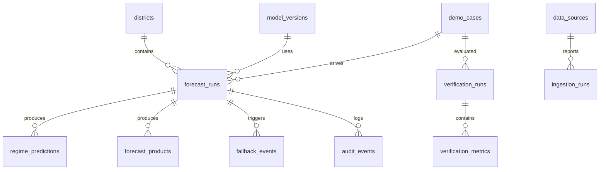

# VARUNA-RAINFALL — Database Design

## 1. Database choice

Supabase PostgreSQL is the primary database.

Use relational tables for core operational entities and JSONB for:
- model output packets
- feature snapshots
- provenance
- evidence
- audit records

Official district geometry can later move to PostGIS. The prototype uses simplified demo geometries/centroids and labels them synthetic.

---

## 2. Entity relationship overview



---

## 3. Tables

### districts

Purpose:
- district master
- demo map location
- future official geometry reference

Fields:
- id
- name
- state
- country
- lat
- lon
- geometry_geojson
- geometry_version
- is_demo_geometry
- created_at

### demo_cases

Purpose:
- deterministic test scenarios

Fields:
- id
- name
- description
- event_date
- regime_hint
- synthetic_features
- seed
- is_demo

### data_sources

Purpose:
- source registry

Examples:
- NWP
- Satellite
- Observation
- Reanalysis
- Terrain

Fields:
- id
- name
- source_type
- version
- expected_interval_minutes
- stale_after_minutes
- last_success_at
- status

### ingestion_runs

Purpose:
- source health

Fields:
- id
- source_id
- started_at
- finished_at
- rows_ingested
- records_missing
- schema_valid
- status
- error_message

### model_versions

Fields:
- id
- name
- version
- model_type
- status
- metadata
- created_at

### forecast_runs

One generated forecast execution.

Fields:
- id
- case_id
- district_id
- model_version_id
- issue_time
- valid_time
- lead_hours
- accumulation_window
- source_version
- raw_rain_mm
- observed_rain_mm
- ensemble_mean_mm
- ensemble_std_mm
- qc_status
- data_quality
- created_at

### regime_predictions

Fields:
- id
- forecast_run_id
- active_probability
- break_probability
- depression_probability
- coastal_probability
- orographic_probability
- western_disturbance_probability
- transition
- confidence
- evidence JSONB
- engine_version

### forecast_products

Fields:
- id
- forecast_run_id
- correction_method
- expected_rain_mm
- q10_mm
- q50_mm
- q90_mm
- positive_probability
- p64_5
- p115_6
- p204_5
- uncertainty_mm
- calibration_status
- fallback_state
- provenance
- human_review_required

### verification_runs

Fields:
- id
- case_id
- split_name
- data_quality
- run_version
- started_at
- finished_at

### verification_metrics

Fields:
- id
- verification_run_id
- method_name
- threshold_mm
- lead_day
- neighbourhood_km
- rmse
- ets
- csi
- pod
- far
- fss
- brier
- brier_skill_score
- event_count

### fallback_events

Fields:
- id
- forecast_run_id
- from_state
- to_state
- reason_code
- reason_detail
- created_at

### audit_events

Fields:
- id
- forecast_run_id
- event_type
- payload
- created_at

---

## 4. Indexing

Create indexes on:

```text
forecast_runs(case_id)
forecast_runs(district_id)
forecast_runs(valid_time)
forecast_products(forecast_run_id)
verification_metrics(verification_run_id)
fallback_events(forecast_run_id)
audit_events(forecast_run_id)
```

Composite:

```text
forecast_runs(district_id, valid_time)
forecast_runs(case_id, district_id)
```

---

## 5. RLS strategy

For hackathon demo:
- frontend can read demo-safe tables
- backend/service role performs writes

Production:
- authenticated read by role
- operational writes restricted to service accounts
- audit immutable to standard users

Never put the Supabase service-role secret in the browser.

---

## 6. Data quality flags

Allowed:

```text
synthetic_demo
authorised_real
mixed
invalid
```

Prototype seed records use:

`synthetic_demo`

---

## 7. Versioning

Every forecast result must reference:

```text
data version
model version
calibration version
geometry version
```

This is the database-level implementation of forecast provenance.
