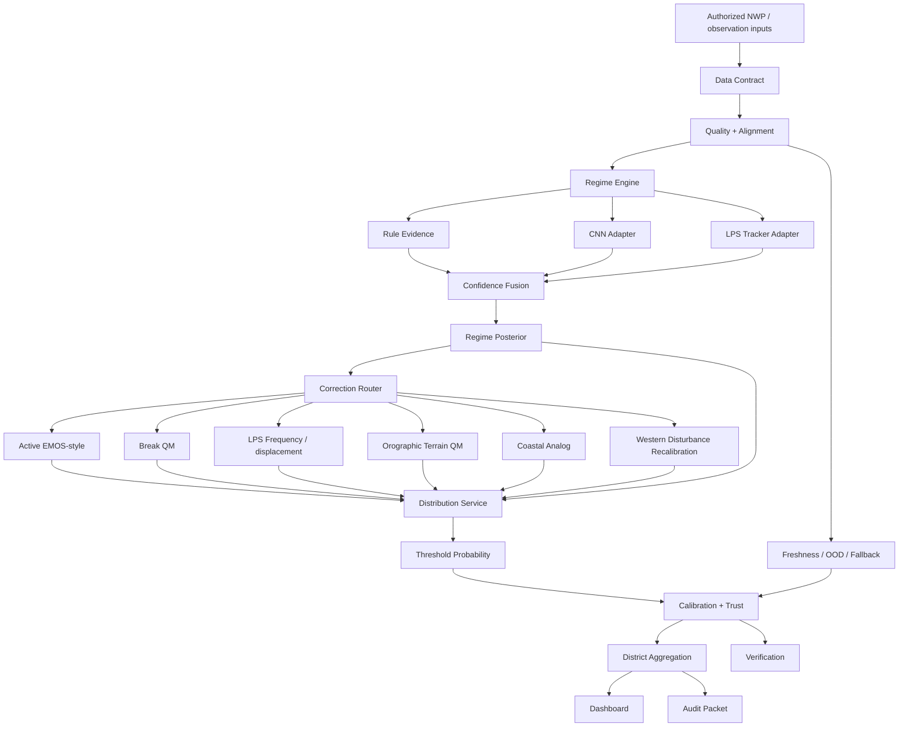
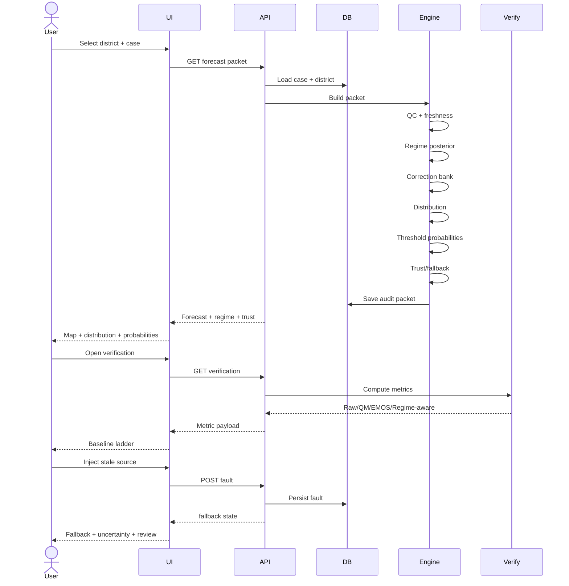
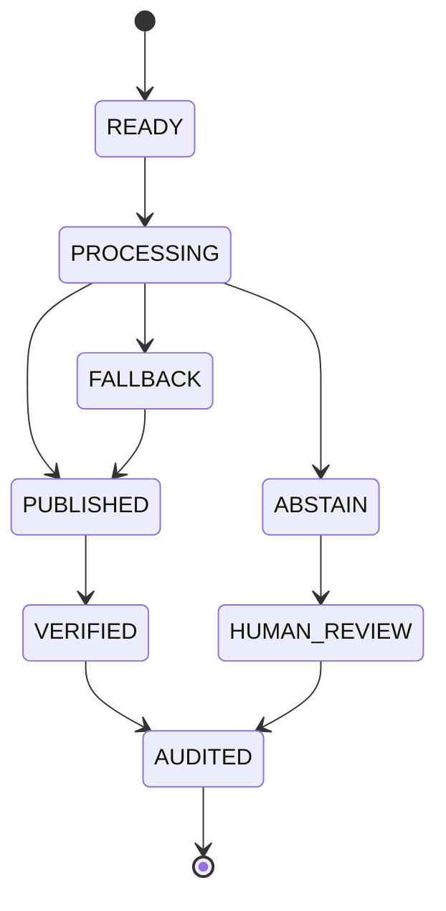

# VARUNA-RAINFALL — System Flow

## 1. End-to-end architecture



---

## 2. Five-stage scientific flow

### Stage 1 — Data ingestion

```text
source → contract validation → timestamps → units → grid → provenance
```

Required metadata:
- source
- version
- issue time
- valid time
- lead
- accumulation
- units
- grid
- district geometry version
- ingestion timestamp

---

### Stage 2 — Weather regime classifier

```text
physics rules
    +
CNN pattern encoder
    +
LPS tracker
    ↓
confidence-weighted fusion
    ↓
regime posterior
```

Regime set:
- active
- break
- depression
- orographic
- coastal
- western disturbance

UI adds:
- transition/uncertain

---

### Stage 3 — Conditional correction

```text
regime posterior
      ↓
bank selection
      ↓
correction
      ↓
residual/spatial adjustment
```

The production design calls for:
- EMOS/shifted-gamma for active/break
- tracker-conditioned frequency matching for LPS
- terrain-aware QM for orographic
- coastal analog correction
- elevation-stratified recalibration for western disturbances
- optional ConvLSTM residual correction

The hackathon prototype should expose these as adapter names and deterministic demo implementations.

---

### Stage 4 — Heavy-rain probability

```text
corrected distribution
        +
ensemble spread
        +
regime prior
        ↓
P(rain >= threshold)
        ↓
calibration
```

Thresholds:
- 64.5
- 115.6
- 204.5 mm/day

---

### Stage 5 — District product + verification

```text
corrected grid
      ↓
area weighted aggregation
      ↓
district table + map
      ↓
verification
      ↓
audit / retraining signal
```

Metrics:
- RMSE
- ETS
- CSI
- POD
- FAR
- FSS

Additional trust metric:
- Brier / reliability

---

## 3. User journey flow



---

## 4. Fallback flow


Every transition emits an audit event.

---

## 5. Regime uncertainty flow

```text
top1 = depression 0.47
top2 = orographic 0.31

margin = 0.16

=> transition = true
=> do not hard-switch
=> probability blend banks
=> uncertainty width increases
=> calibration = amber
=> human review = true
```

---

## 6. Verification flow

```text
selected case
   ↓
forecast arrays
   ↓
observation arrays
   ↓
threshold event masks
   ↓
H / M / F
   ↓
POD / FAR / CSI / ETS
   ↓
continuous arrays
   ↓
RMSE
   ↓
neighbourhood fractions
   ↓
FSS
```

All metric cards must show:
- threshold
- lead
- event count
- data quality
- split identifier

---

## 7. Demo cases

### Case A — Active monsoon

Narrative:
- widespread rain
- raw NWP under-amplitude
- active probability high
- active EMOS-style bank
- moderate confidence

### Case B — Break monsoon

Narrative:
- central India rain leakage
- break probability high
- break QM
- lower central rainfall
- foothill shift proxy

### Case C — Depression / LPS

Narrative:
- vortex evidence
- LPS probability high
- displacement correction
- high heavy-rain probability
- strong uncertainty if tracker confidence falls

### Case D — Orographic

Narrative:
- terrain elevation high
- orographic probability high
- terrain-aware correction
- higher windward rainfall proxy

### Case E — Transition / uncertain

Narrative:
- multiple regimes
- probability blend
- amber calibration
- human review

---

## 8. Three-minute judge flow

```text
1. Overview map
2. Select LPS case
3. Regime posterior
4. Raw vs corrected
5. q10/q50/q90
6. Heavy thresholds
7. Verification
8. Fault injection
9. Fallback
10. Audit
```

---

## 9. State model



---

## 10. Important prototype rule

The scientific architecture may mention CNN, ConvLSTM, EMOS, LPS tracking and calibrated probabilities, but the UI must show **what is actually running**.

Example:

```text
Regime Engine
[DEMO HEURISTIC]
Production CNN adapter: NOT LOADED
LPS tracker adapter: DEMO
```

This avoids the architecture-vs-implementation gap that the supplied audit materials warn against.
